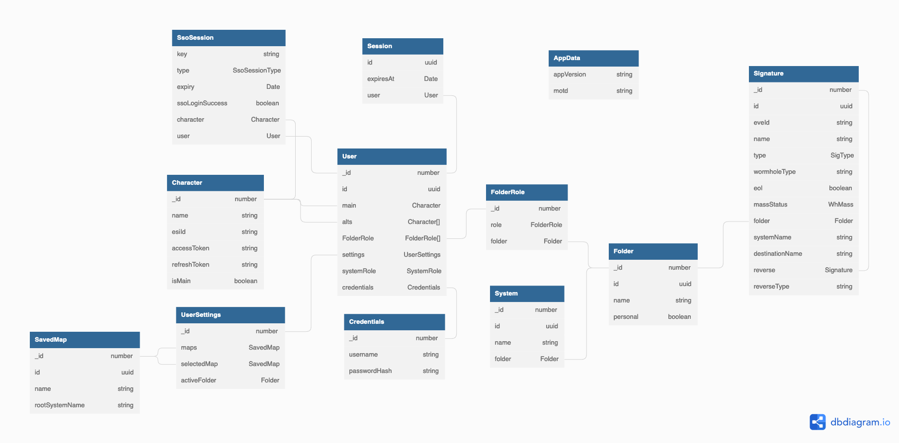

# Database

The development environment spins up Docker containers for a Mongo database and
two Neo4j databases. Two Neo4j's are needed to have separate databases for dev
and test environments, as the community edition does not allow for using
multiple databases per instance.

## Database Diagram

_[Interactive version at dbdiagram.io.](https://dbdiagram.io/d/61277dc26dc2bb6073bc934a)_

The source for the diagram is available
[here](https://github.com/joonashak/holenav/tree/main/docs/src/assets/db_diagram.dbml).
